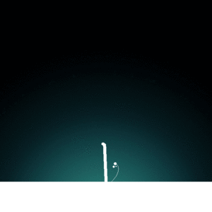

<h1>electric-tree<h1>

 Electric tree is a small data visualization program, winner of the Cleanweb contest 2014

 

The idea behind Electric Tree was to encourage power saving habits through gamification.   
Each branch of the tree corresponds to a user, and the tree feeds on saved electricity, thus making the branch that belongs to the most mindful users grow faster.
